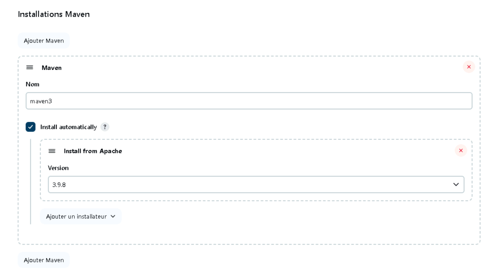
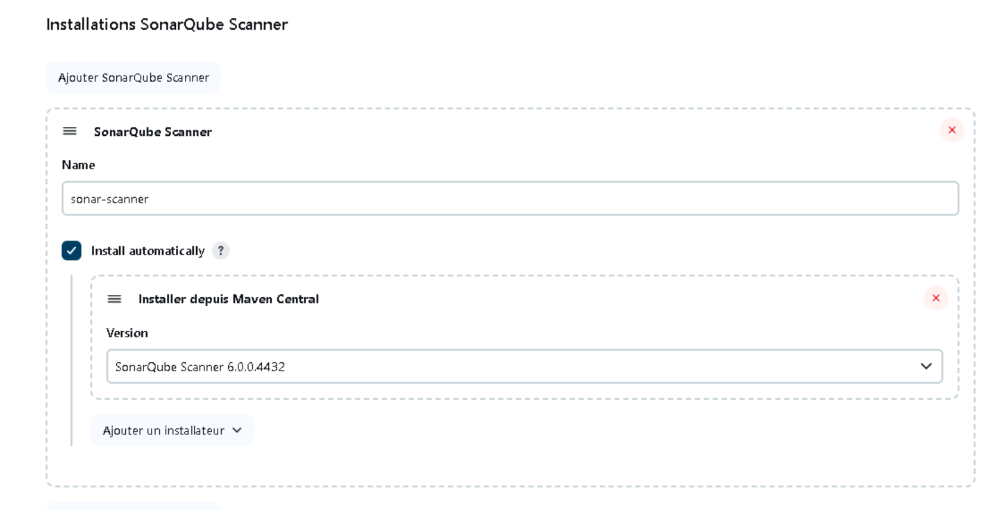
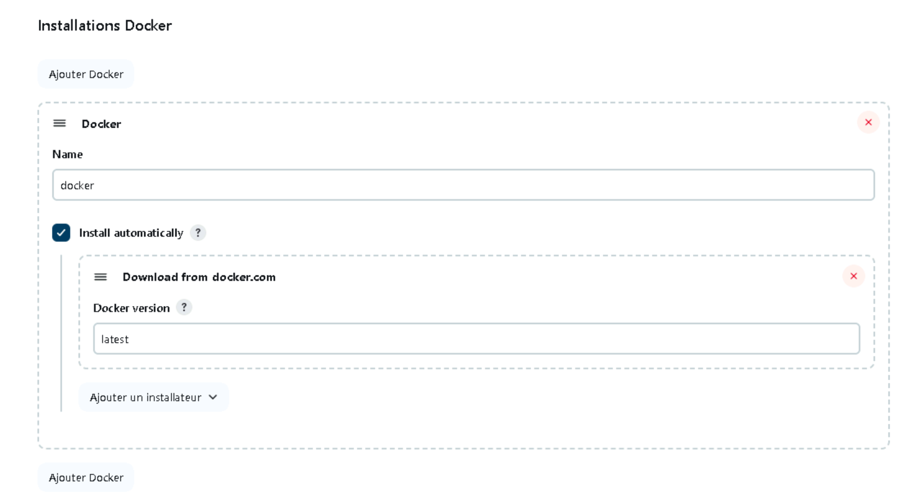

# LAB3 - (Git - Jenkins - SonarQube - Nexus) : Docker compose pour déployer SonarQube et Nexus et Gitlab
**Objectifs :**
* Configurer Sonarqube
* Configurer Nexus
* Installer Jenkins sur windows
* Configurer Jenkins
* Créer une application de test

**IMPORTANT** : Veuillez créer un compte sur Github.com et Dockerhub.com pour ce lab

## Configurer Sonarqube
1. Via le navigateur accèder à : 
>http://localhost:9001

2. Changer le mot de passe admin (admin/admin).

## Configurer Nexus
1. Via le navigateur accèder à : 
>http://localhost:8081

2. Vous pouvez obtenir le mot de pass temporaire en utilisant la commande :
>docker exec -it nexus_nexus_1 /bin/bash
>
>cat /nexus-data/admin.password

3. Changer le mot de passe admin. 

## Créer une application de test 
1. Cloner l'application à partir : 
    >https://github.com/moadmct/Boardgame.git
2. Ouvrir le code dans Codespace sur Github

## Jenkins
### Installer Jenkins sur windows
1. Installer jdk17
    >https://www.oracle.com/java/technologies/javase/jdk17-archive-downloads.html

2. Télécharger et installer Jenkins :
    >https://ftp.belnet.be/mirror/jenkins/windows-stable/2.452.2/jenkins.msi

### Configurer Jenkins
1. Réinitaliser le mot de passe admin
2. Installer les plugins (jdk - maven - docker -sonarqube - kubernetes - nodjs)
Plugins:

 jdk

        1. Eclipse Temurin installer

maven

        1. Maven Integration     

        1. Pipeline Maven Plugin API     

        1. Config File Provider  

        1. Pipeline Maven Integration    

        1. Pipeline Maven Plugin API    

Sonarqube 

        1. SonarQube Scanner     

Docker  

        1. Docker API    

        1. Docker    

        1. docker-build-step

Kubernetes    

        1. Kubernetes Client API     

        1. Kubernetes Credentials    

        1. Kubernetes    

        1. Kubernetes Credentials Provider

Nodejs

        1. NodeJS
    
1. Configurer les outils
    1. jdk17
    
    1. maven3
    
    1. sonar-scanner

    1. docker
    
1. Création des credentials (Github - Dockerhub - Sonarqube)
    C'ets sur Sonarqube qu'on génè la clé
    

    ensuite on le copie et le colle dans Jenkins 
    
    

1. Configurer le système
    1. sonar > http://localhost:900 
1. Créer un onfiguration Global-Settings 

### Création de Pipeline CI/CD
1. Créer une nouvelle Pipeline CI/CD sous Jenkins 'cicd_app1'
1. Copie le contenu du fichier suivant dans votre pipeline :
    > cicd.yml
1. Démarrer la construction *build* et voir le résultat
1. Va dans dockerhub.com et voir si l'image a été bien présente dans votre répértoire.

dsdssf
